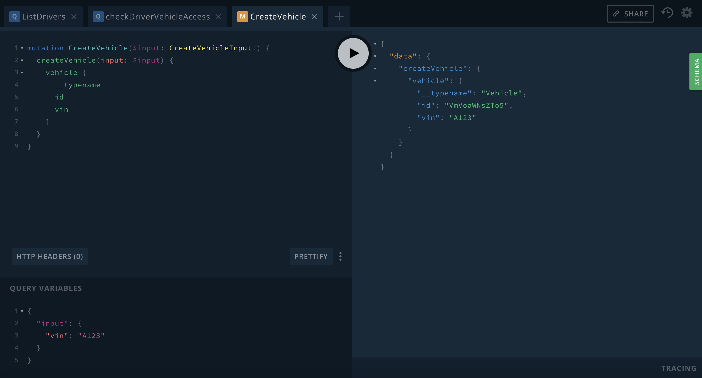

# Fleet

You will need [PostgreSQL](https://www.postgresql.org/) running locally or [`apps/fleet/config/dev.exs`](https://github.com/potatosalad/fleet/blob/master/apps/fleet/config/dev.exs) will need to be modified in order to connect to your postgres instance.

Getting started:

```bash
mix deps.get
mix deps.compile
(cd apps/fleet && mix ecto.setup)
iex -S mix phx.server
```

_Note:_ hit Control/Command+C twice to exit the interactive shell.

Navigate to [http://localhost:4002/api/graphiql](http://localhost:4002/api/graphiql) (or `POST` directly with `{"query":"...","variables":{}}` to [http://localhost:4002/api/graphql](http://localhost:4002/api/graphql)).

_Note:_ if you make changes to the migrations, seeds, or otherwise need to reset the database, run `(cd apps/fleet && mix ecto.reset)`

### To-do

- [ ] Get the project up and running.
- [ ] Try out some of the examples listed below in the [GraphQL Playground](https://github.com/prisma/graphql-playground) hosted at [http://localhost:4002/api/graphiql](http://localhost:4002/api/graphiql)
- [ ] Try writing some of your own queries and mutations or modifying existing ones to fetch additional information.
- [ ] Try modifying the query or mutation definitions to explore how they affect the data or errors returned over GraphQL.
- [ ] Search throughout the project (under the [`apps`](https://github.com/potatosalad/fleet/tree/master/apps) directory) for code comments starting with `TODO`
- [ ] Implement the resolvers mentioned in the `TODO` comments and write example GraphQL queries and mutations to confirm their functionality as you go.
- [ ] Try adding something new to the project.  For example, add a new table which would require a new node type and query/mutation definitions.  Or add a useful computed field onto an existing object type.

### Examples

#### List all drivers with name

_query_

```graphql
query ListDriversWithName {
  drivers {
    name
  }
}
```

_variables_

```json
{}
```

#### List all drivers with id, name, and accessible vehicles

_query_

```graphql
query ListDrivers {
  drivers {
    __typename
    id
    name
    accessibleVehicles {
      __typename
      id
      vin
    }
  }
}
```

_variables_

```json
{}
```

#### Revoke driver vehicle access

_query_

```graphql
mutation RevokeDriverVehicleAccess($input: RevokeDriverVehicleAccessInput!) {
  revokeDriverVehicleAccess(input: $input) {
    result
  }
}
```

_variables_

```json
{
  "input": {
    "driverId": "RHJpdmVyOjE=",
    "vehicleId": "VmVoaWNsZTox"
  }
}
```

#### Create vehicle

_query_

```graphql
mutation CreateVehicle($input: CreateVehicleInput!) {
  createVehicle(input: $input) {
    vehicle {
      __typename
      id
      vin
    }
  }
}
```

_variables_

```json
{
  "input": {
    "vin": "A123"
  }
}
```

Example screenshot of GraphQL Playground:

[](docs/create-vehicle.png)
